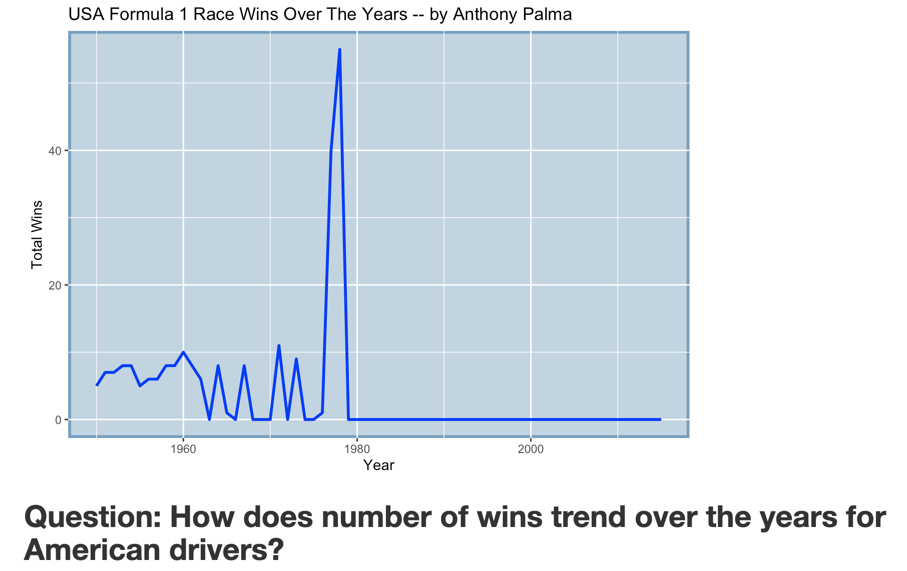

Below are my assignments for the weekly Tidy Tuesday challenge.  

## Week 1:  Formula 1 Racing

{width=200}

#I am not a big F1 racing fan and was completely unaware of many American drivers being involved. I assumed, as there are many other nationality drivers, that it was more of a European centered sport. I chose to look at American wins over the years as I was curious to see how well American drivers have performed in a sport that I think is not super well known in America. As I suspected, I would guess it is not as well knwon possibly because of the trend seen above. With little American success (actually 0 wins since a bit before 1980), if someone wasn’t an avid fan they most likely would not know much as opposed to more American-centric sports like football.

## Week 2: Billboard Top Hits

{width=200}

#I have heard of many songs going on and off the billboard top hits list.  I was curious as to how the speed to the top of the list is different from songs that only were popular for one stint compared to songs that went on and off the list many times, specifially on and off a lot of times.  As you can see, songs that are big hits one time only (ie on and off the list, not on and off several times) saw a very quick and steep rise to the top of the list (denoted by a steep slope down).  As the instance of the song increases, you can see less of a skew on the graph as opposed to the instance == 1 sharp right skew.  